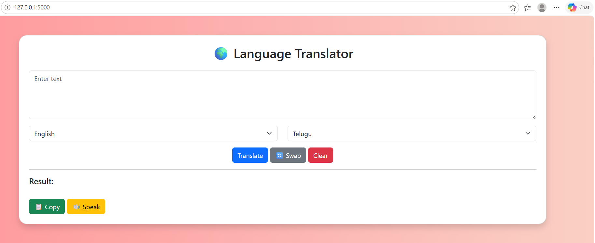
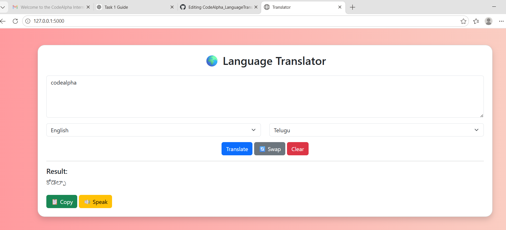
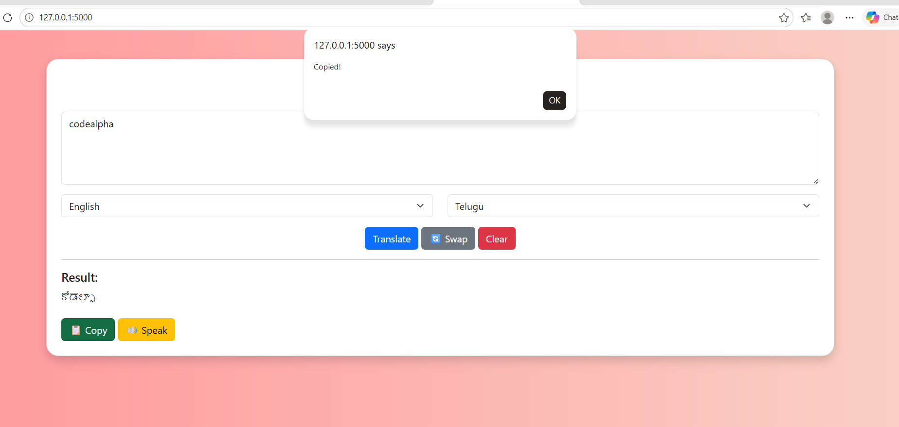

# CodeAlpha_LanguageTranslator
# 🌍 Language Translation Tool
This project is developed as part of my AI Internship at CodeAlpha.
## 🚀 Features
✔️ Translate text between multiple languages  
✔️ Text-to-Speech (Voice Output) 🔊  
✔️ Copy translated text 📋  
✔️ Language Swap 🔄  
✔️ Beautiful UI using Bootstrap  
## 🛠️ Technologies Used
- Python
- Flask
- HTML, CSS (Bootstrap)
- Deep Translator
## 📸 Project Demo
### 🖥️ Main UI

### 🔄 Translation Result

### ⚙️ Features

## ▶️ How to Run
1. Install dependencies:
   pip install flask deep-translator
2. Run the project:
   python app.py
3. Open browser:
   http://127.0.0.1:5000/
## 📌 Author
Prameela K
## 🔗 GitHub Repo
https://github.com/prameela1017/CodeAlpha_LanguageTranslator
